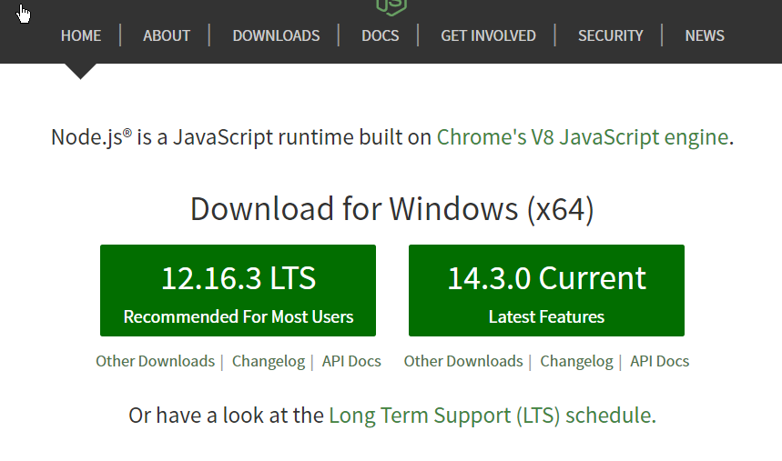

## To work with Current, ES5 import and export syntax:

$ ../node.exe index.js
^^this is path to nodeCurrentVersion.(Current version shows no warning). Works good without any flag warning.

***

## To work with LTS, ES5 import and export syntax:

You just need to do two things:

1. Add  "type": "module" to your package.json file, with its top level property.
2. Run commands for node like : node --experimental-modules <filename>.

### Drawback : It shows a warning like: 

(node:19964) ExperimentalWarning: The ESM module loader is experimental.

```
$ node --experimental-modules index.js
(node:19964) ExperimentalWarning: The ESM module loader is experimental.
Hello, World!
Hello, World!
```


***



